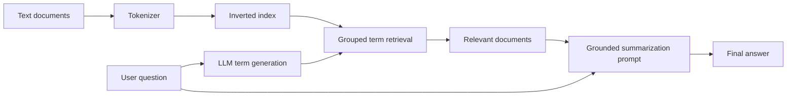

# DocuQuest

DocuQuest is a C++ retrieval-augmented question-answering system. It indexes a document collection, uses an LLM to translate a natural-language question into search-term groups, retrieves matching documents, and generates an answer grounded in the retrieved text.

## Architecture



## How retrieval works

1. The tokenizer converts document text into lowercase alphanumeric terms.
2. A custom binary-search-tree multimap stores each term and the documents containing it.
3. The LLM generates up to 20 search-term groups from the user's question.
4. Terms within a group are combined with intersection logic; results across groups are merged.
5. The system deduplicates and sorts matches, then limits the grounded context to ten documents.
6. A second prompt asks the LLM to answer using only the retrieved document text.

## Engineering highlights

- Implemented a tokenizer with incremental iteration
- Built a custom multimap on a binary search tree
- Constructed an inverted document index
- Used set intersection and deduplication for multi-term retrieval
- Separated indexing, retrieval, prompt construction, and answer generation behind interfaces
- Managed dynamically allocated polymorphic components with explicit cleanup

## Technology

- C++17
- Custom data structures and iterators
- File-system document ingestion
- Retrieval-augmented generation
- External LLM interface

## Source code

The `src/` directory contains my original implementations of the system's core components:

- `tokenizer.*` - incremental text tokenization
- `multimap.*` - binary-search-tree multimap and iterator
- `index.*` - document ingestion and inverted indexing
- `agent.*` - grouped retrieval and grounded answer generation

The implementations depend on interfaces supplied by the UCLA course framework. Those instructor-provided files, generated test documents, build products, and credentials are intentionally not redistributed here, so this snapshot is intended for code review rather than as a standalone build.

## Demonstration flow

```text
Loading documents...
Indexed <document count> documents.
Enter question: <natural-language question>
<answer grounded in matching documents>
```

## Repository status

This repository includes my implementation code. Academic starter code, instructor-provided components, generated test documents, binaries, and local IDE state are excluded.

## Author

Arnav Praveen, UCLA Computer Engineering
