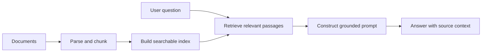

# DocuQuest

DocuQuest is a retrieval-augmented question-answering system written in C++. It turns a collection of documents into a searchable knowledge base and produces answers grounded in retrieved source material.

## Why I built it

Long documents are difficult to search when the user does not know the exact terminology or location of an answer. DocuQuest explores how a compact C++ pipeline can combine document ingestion, retrieval, and answer generation while keeping the supporting context visible.

## System design

## Core capabilities

- Ingests and processes document collections
- Breaks content into retrieval-friendly passages
- Finds passages relevant to a natural-language question
- Builds answers from retrieved context instead of relying only on model memory
- Preserves source context so results can be checked

## Engineering focus

- C++ data structures and memory-conscious processing
- Modular separation between ingestion, retrieval, and response generation
- Clear failure handling for empty documents and low-confidence retrieval
- Reproducible document-to-answer workflow

## Demonstration flow

1. Add one or more documents to the input collection.
2. Run the ingestion and indexing stage.
3. Submit a natural-language question.
4. Inspect the retrieved passages.
5. Review the generated answer alongside its source context.

## Technology

- C++
- Retrieval-augmented generation
- Document parsing and text chunking
- Semantic retrieval

## Repository status

This repository is a public project case study. The original source code and demonstration assets are not included yet. They will be added after the project files are reviewed for course, team, and data-sharing restrictions.

## Author

Arnav Praveen, UCLA Computer Engineering
